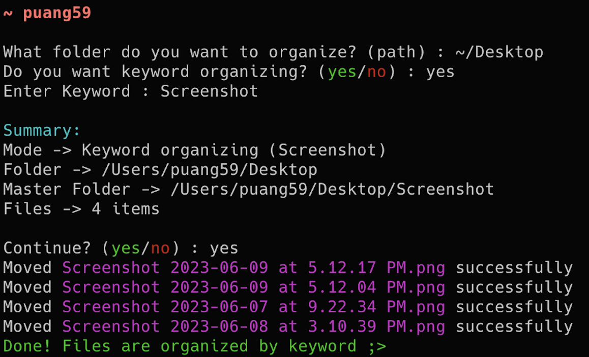
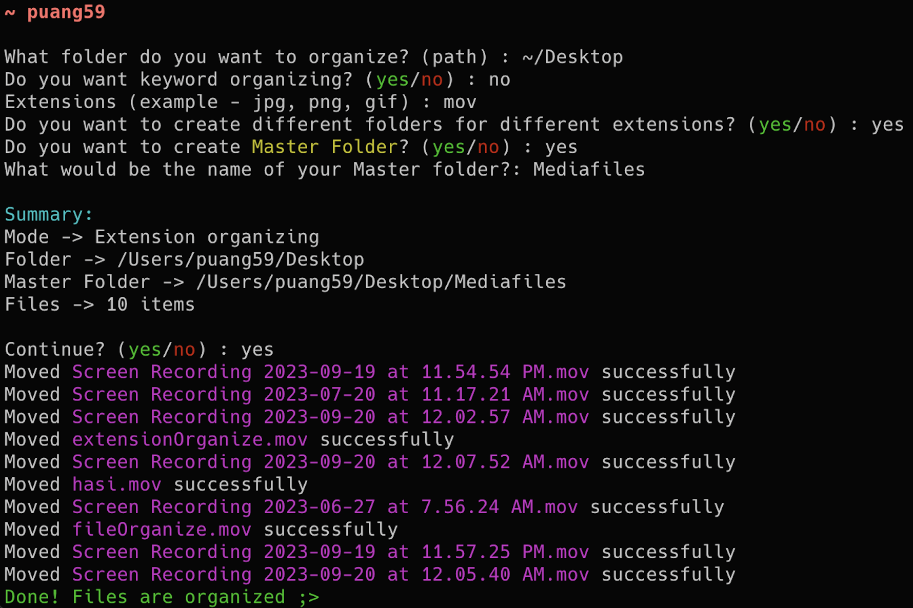

<p align="left">
  
</p>

<hr>

FileEase is a command-line tool designed to simplify the organization of your files. It effortlessly sorts your files based on keywords and extensions, ensuring your digital workspace is tidy and efficient.

## Features

- **Keyword-Based Organization**: FileEase automatically creates folders with specified keywords and moves files containing those keywords in their names to the respective folders. For example, if you have files with "screenshot" in their names, FileEase will create a "screenshot" folder and neatly organize them for you.

- **Extension-Based Sorting**: If you prefer to sort files by their extensions, FileEase can create folders for different file extensions and categorize your files accordingly. For instance, all your PNG files will be grouped together in a "png" folder, while MOV files will have their own "mov" folder.

## Screenshots

### Keyword Mode
<p align="left">
  
</p>

### Extension Mode
<p align="left">
  
</p>

<hr>

## Getting Started

1. **Clone the Repository**:
   ```bash
   git clone https://github.com/puang59/FileEase.git
   ```

2. **Install Dependencies**:
   ```bash
   pip install -r requirements.txt
   ```

3. **Run FileEase**:
   ```bash
   python fileease.py
   ```

## Contribute

We welcome contributions from the open-source community. Feel free to [fork this repository](https://github.com/puang59/FileEase/fork) and submit pull requests to help improve FileEase.

## License

This project is open-source under the [MIT License](LICENSE). While you're free to view, use, and contribute to the code, please refrain from distributing it as your own. 
