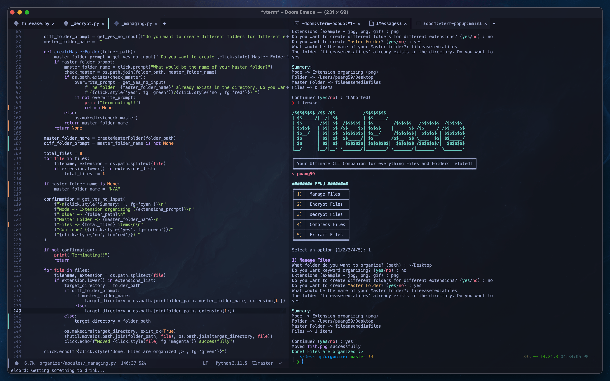
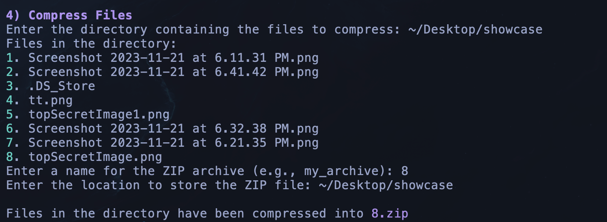

<p align="left">
  
</p>

<hr>

FileEase is a command-line tool designed to simplify the organization of your files. It effortlessly sorts your files based on keywords and extensions, ensuring your digital workspace is tidy and efficient. FileEase also helps you to encrypt and compress your files easily from your command line.

<p align="left">
  
</p>

Video Demo: https://youtu.be/AwcSrI3sijQ?si=2f3wi8B29QBmd5aV

## Overview
This project consists of main fileease.py file which loads all the modules from module folder like managing, encryption, compression etc
Here is short overview about each modules: 

- _managing.py 
This script employs the click library to create a streamlined command-line interface (CLI) for user interaction. It leverages Python's standard libraries such as os for file and directory operations and shutil for file movements. The script employs a structured approach: it first allows users to select a directory for organization, then presents choices for categorizing files based on either keywords or extensions. For each categorization method, users have the flexibility to either organize files directly in the chosen directory or encapsulate them within a designated "Master Folder". This logic ensures a systematic and customizable file organization process.

## Features

### Manage Files
- **Keyword-Based Organization:** FileEase automatically creates folders with specified keywords and moves files containing those keywords in their names to the respective folders. For example, if you have files with "screenshot" in their names, FileEase will create a "screenshot" folder and neatly organize them for you.
  

- **Extension-Based Sorting:** If you prefer to sort files by their extensions, FileEase can create folders for different file extensions and categorize your files accordingly. For instance, all your PNG files will be grouped together in a "png" folder, while MOV files will have their own "mov" folder.
  

### Encryption & Decryption
- **File Encryption:** FileEase effortlessly secures files, whether they're PDFs, PPTX, or images, providing an encryption key for secure storage in keys.txt, ensuring easy decryption when needed.
  

- **File Decryption:** FilEase can decrypt any type of file if a valid key is provided
  

### Compress & Extract
- **File Compression:** Filease ease can effortlessly compress your files and folders right from your command line.
    

- **File Extraction:** Filease ease can effortlessly extract your files and folders right from your command line.
  
<hr>

## Getting Started

1. **Clone the Repository**:
   ```bash
   git clone https://github.com/puang59/FileEase.git
   ```

2. **Install Dependencies**:
   ```bash
   pip install -r requirements.txt
   ```

3. **Run FileEase**:
   ```bash
   python fileease.py
   ```

## Contribute

We welcome contributions from the open-source community. Feel free to [fork this repository](https://github.com/puang59/FileEase/fork) and submit pull requests to help improve FileEase.

## License

This project is open-source under the [MIT License](LICENSE). While you're free to view, use, and contribute to the code, please refrain from distributing it as your own. 
<br><br>
Made with ❤️ by Karan 
